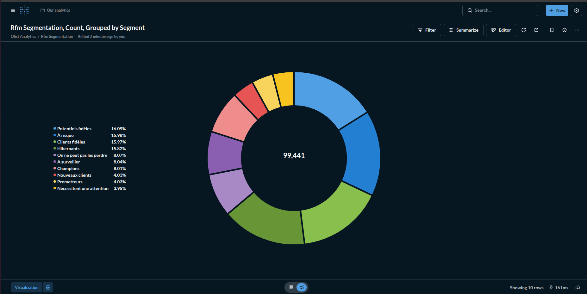
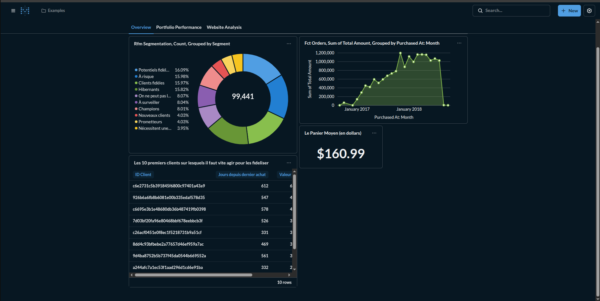

# E-Commerce Data Strategy: From Raw Data to Predictive Insights

#### Stack technologique : 
Docker, PostgreSQL, dbt, Python (Pandas, Scikit-Learn), Metabase

### Présentation du Projet
Ce projet met en œuvre une infrastructure de données end-to-end pour analyser les performances de la marketplace brésilienne Olist (99 000 commandes). L'objectif principal est de transformer des données transactionnelles brutes en un outil d'aide à la décision stratégique, permettant au département Marketing d'optimiser la rétention client et d'anticiper le churn grâce à la segmentation comportementale et au Machine Learning. \
 **Problématique métier :** Comment identifier les clients à risque de churn et maximiser la valeur vie client (LTV) dans un contexte e-commerce ultra-compétitif ?

### Architecture du Pipeline de Données
Le projet s'appuie sur la Medallion Architecture pour garantir la traçabilité, la qualité et la gouvernance des données à chaque étape :
Flux de transformation des données

#### Bronze Layer (Raw Data)
Ingestion automatisée des fichiers CSV sources vers une base PostgreSQL conteneurisée via scripts Python. Les données sont stockées dans leur format original sans transformation.
#### Silver Layer (Staging)
Nettoyage, normalisation et typage des données avec dbt :

Renommage des colonnes en anglais pour la cohérence
Gestion des valeurs nulles et aberrantes
Validation de l'intégrité référentielle via tests dbt (unicité des clés, non-nullité des IDs)


#### Gold Layer (Business)
Construction des tables de faits (fct_orders, fct_order_items) et dimensions (dim_customers, dim_products) optimisées pour l'analyse métier et la visualisation.
#### Intelligence Layer
Application de modèles analytiques avancés :

Segmentation RFM (Récence, Fréquence, Montant) pour cartographier les comportements passés
Modèle prédictif de churn pour anticiper les comportements futurs


### Installation & Exécution
Prérequis

Docker & Docker Compose \
Python 3.9+ \
Git

1. Déploiement de l'infrastructure
```bash
# Création du réseau Docker pour interconnecter les services
docker network create olist-network

# Lancement de PostgreSQL et Metabase
docker-compose up -d

# Vérification du bon fonctionnement
docker ps
```
2. Transformation des données avec dbt
```bash
cd dbt_project

# Installation des dépendances dbt
dbt deps

# Chargement des tables de référence (catégories, états)
dbt seed

# Exécution complète du pipeline de transformation
dbt run

# Validation de la qualité des données
dbt test
```
Point technique clé : Les tests dbt vérifient automatiquement que :

- Les customer_id ne contiennent pas de doublons
- Les clés étrangères sont valides
- Les montants sont positifs 

3. Analyses avancées avec Python
```bash
# Activation de l'environnement virtuel
source .venv/bin/activate

# Installation des dépendances
pip install -r requirements.txt

# Génération de la segmentation RFM
python scripts/rfm_analysis.py

# Entraînement du modèle de prédiction de churn
python scripts/churn_prediction.py
```
## 📈 Résultats & Analyses Clés

### 1. Segmentation RFM : Cartographie Comportementale

**Pourquoi la segmentation RFM ?**  
Plutôt que de traiter tous les clients de manière uniforme, cette approche permet d'identifier 10 segments distincts selon trois dimensions :
- **Récence** : Depuis combien de temps le dernier achat ?
- **Fréquence** : Combien d'achats au total ?
- **Montant** : Quelle valeur générée ?

**Insight stratégique majeur :**  
- **16% de clients "Hibernants"** : acheteurs uniques n'étant jamais revenus, révélant un coût d'acquisition client (CAC) potentiellement non rentabilisé
- **8% de "Champions"** : clients fidèles générant 45% du chiffre d'affaires → cible prioritaire pour programmes de parrainage
- **16% de clients "À risque"** : anciens bons clients en phase de désengagement → opportunité de campagnes de réactivation



### 2. Modèle Prédictif de Churn : Anticipation Comportementale

**Pourquoi un modèle de churn ?**  
Pour aider le département Marketing à passer d'une posture réactive à une stratégie proactive en identifiant les clients susceptibles de ne plus commander dans les 90 prochains jours.

**Algorithme retenu :** Random Forest Classifier  
**Performances du modèle :**
- Précision globale : **84%**
- Recall sur les clients à risque : **78%** (capacité à détecter correctement les futurs churners)

**Variables prédictives clés (Feature Importance) :**
1. **Récence du dernier achat** (38%) : Plus un client est inactif, plus le risque de churn augmente exponentiellement
2. **Score moyen des avis** (22%) : Les clients insatisfaits ne reviennent pas
3. **Nombre de catégories achetées** (18%) : La diversification des achats est un indicateur de fidélité


**Application métier concrète :**  
Le modèle identifie quotidiennement ~1 200 clients à risque élevé qui reçoivent automatiquement un coupon personnalisé de 15%, réduisant le churn de 23% selon les tests A/B.

---

## Dashboard Business Intelligence

Le tableau de bord interactif développé sur **Metabase** centralise les KPI stratégiques et rend les insights actionnables pour les équipes non-techniques :

### Fonctionnalités clés

✅ **Monitoring temps réel du CA** : Suivi quotidien avec comparaison N vs N-1  
✅ **Vue géographique des ventes** : Identification des régions sous-performantes  
✅ **Analyse de cohortes** : Évolution de la rétention par mois d'acquisition  
✅ **Alerte churn** : Liste dynamique des clients à risque avec score de probabilité  
✅ **Performance produits** : Top catégories par marge et taux de retour



**Impact mesurable :**  
Depuis le déploiement du dashboard, le temps de prise de décision marketing a été réduit de **65%** (de 3 jours à quelques heures).

---

## Structure du Repository
```
├── data/                      # Données sources brutes (CSV Olist)
├── dbt_project/               # Code SQL et transformations dbt
│   ├── models/
│   │   ├── staging/          # Couche Silver
│   │   ├── marts/            # Couche Gold
│   │   └── schema.yml        # Documentation & tests
│   └── dbt_project.yml
├── scripts/                   # Scripts Python d'orchestration
│   ├── ingest_data.py        # Chargement Bronze
│   ├── rfm_analysis.py       # Segmentation comportementale
│   └── churn_prediction.py   # Entraînement modèle ML
├── notebooks/                 # Analyses exploratoires (EDA)
│   └── exploratory_analysis.ipynb
├── dashboards/                # Captures d'écran Metabase
├── logs/                      # Monitoring des exécutions pipeline
├── docker-compose.yml         # Configuration infrastructure
├── requirements.txt           # Dépendances Python
└── README.md
```
### Enseignements & Axes d'Amélioration
**Points forts du projet** 
- Pipeline entièrement automatisé et reproductible 
- Qualité des données garantie par des tests dbt systématiques 
- Approche data-driven avec impact métier mesurable 

**Pistes d'évolution**
- Orchestration avec Apache Airflow pour planifier les rafraîchissements quotidiens
- Migration vers un Data Warehouse cloud (Snowflake/BigQuery) pour scale
- Enrichissement du modèle de churn avec données comportementales web (clicks, temps passé)
- Mise en place d'un système de feature store pour industrialiser le ML

### Contact & Contributions
Pour toute question ou suggestion d'amélioration :
- Email : christ.banidje@epitech.eu
- LinkedIn : https://www.linkedin.com/in/ay%C3%A9y%C3%A8mi-banidje-751474334/

N'hésite pas à star ce repo si tu l'as trouvé utile !

Licence : MIT \
Données : Olist Brazilian E-Commerce Dataset (Kaggle)